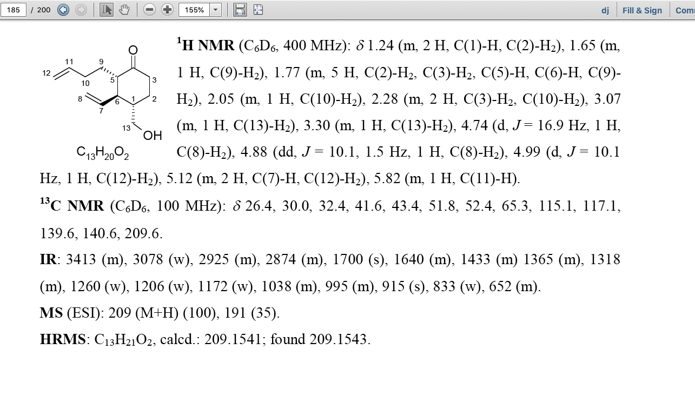

# CHEMeDATA-maker

[![NPM version][npm-image]][npm-url]
[![build status][ci-image]][ci-url]
[![npm download][download-image]][download-url]

Add CHEMeDATA to documents.

## Goal

Faciliate the association of spectroscopic data (in form of text) to chemical structures.
In the annexe of many PhD thesis, the spectroscopic data are shown next to the structure.



We should show, next to a molecules (which structure [was extracted from a pdf](https://github.com/CHEMeDATA/fixingmolfiles)) the text (which was extracted using pdfjs-dist) which was located next to the compound. 


## Installation

`$ npm i CHEMeDATA-maker`

## Usage

```js
import library from 'CHEMeDATA-maker';

const result = library(args);
// result is ...
```

## [API Documentation](https://CHEMeDATA.github.io/CHEMeDATA-maker/)

## License

[MIT](./LICENSE)

[npm-image]: https://img.shields.io/npm/v/CHEMeDATA-maker.svg
[npm-url]: https://www.npmjs.com/package/CHEMeDATA-maker
[ci-image]: https://github.com/CHEMeDATA/CHEMeDATA-maker/workflows/Node.js%20CI/badge.svg?branch=master
[ci-url]: https://github.com/CHEMeDATA/CHEMeDATA-maker/actions?query=workflow%3A%22Node.js+CI%22
[download-image]: https://img.shields.io/npm/dm/CHEMeDATA-maker.svg
[download-url]: https://www.npmjs.com/package/CHEMeDATA-maker


## Initial creation of node module 
Starting point using[create-a-new-project](https://github.com/cheminfo/generator-cheminfo/blob/master/START.md#create-a-new-project)

